# Launching an EC2 Instance

I will be using this section to demonstrate how to launch an EC2 instance.

Let’s get started.

## Step 1: Create an AWS Free Account and Log In

First, create an account on the **Management Console** and log in.

It is going to take you to the console home.

At the top left, you will see **Search input**. Click on it.

Then search for **EC2**. It is going to bring some other options with it, but look for **EC2** and click on it.

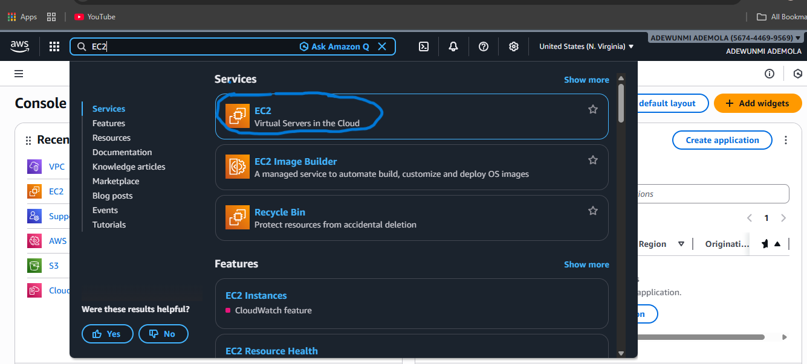

## step 2: Navigate to the EC2 Dashboard

It is going to take you to another page with a **Launch Instance** orange button to the right, but before you click on it, look at the top tab. You will see **United States (N. Virginia)**. United States (N. Virginia) is the Region
the Availability Zone would be something like **us-east-1a**. You can pick where you want to put your EC2 instance. You can change it to anywhere you want, although there are things that are going to determine how to decide that properly. I will discuss that in the future, including edge locations.

Now click on **Launch Instance**.

## step 3: Name and Tags
This is where you name your instance, but let’s go with **My-web-server**.

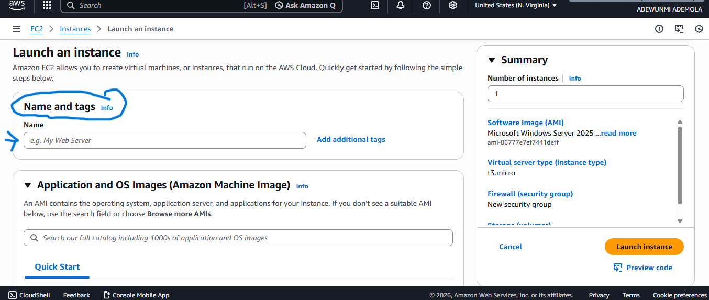

## step 4: Application and OS Image (Amazon Machine Image)

This is called an **AMI (Amazon Machine Image)**. It is used to set up your instance. Look at it like a blueprint for your instance.

We will be going with **Windows** because most people are familiar with Windows. Click on Windows.

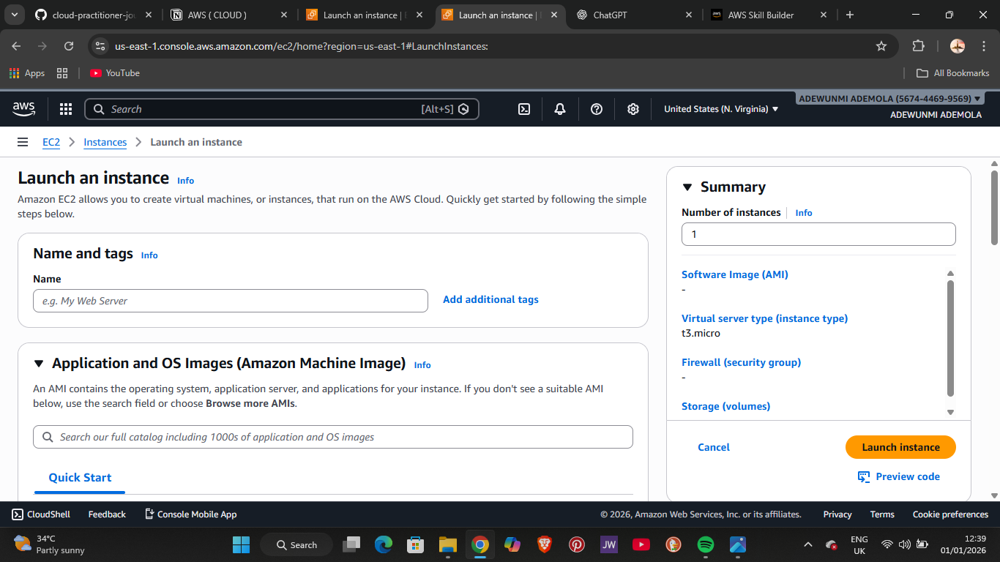

You will see more about your AMI, and you can change the AMI blueprint, but only a few are free.

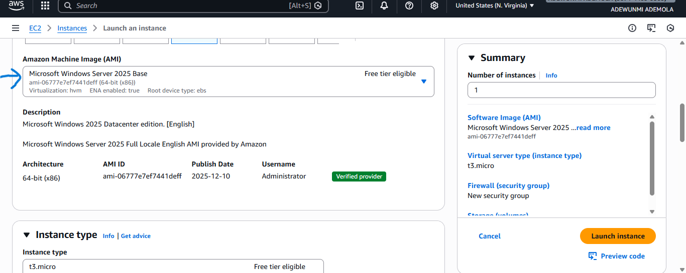

## step 5: Instance Type

This section is telling how powerful your instance is. You will see t3.micro, t3.small, and so on, with different levels of power. It is safe to call this the engine of your instance.

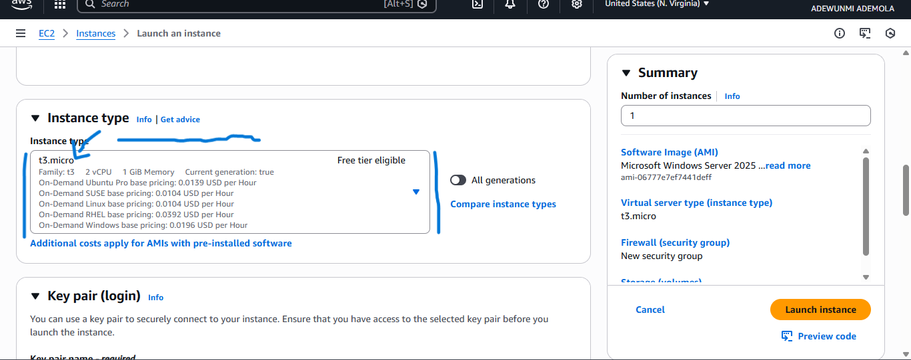

## step 6: Key Pair (Login)

This section lets you access your instance safely. We need to create a new key pair.

Name your key pair and click **Create key pair**. It will download the key pair to your system. You can access it in your file explorer under **Downloads**, but we will not need it now.

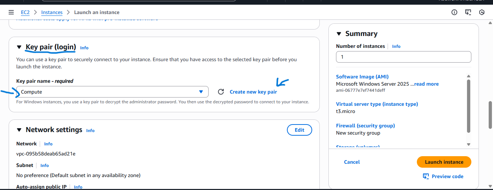

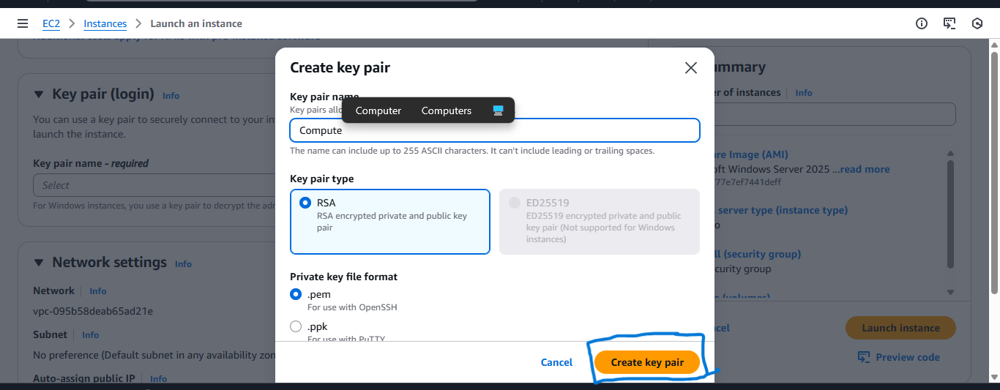

## step 7: Network, Storage, and Advanced Settings

Under the networking section, enable HTTP and leave the remaining options as default.

The rest of the sections include network, storage, and advanced settings, which we will leave as default for this EC2 instance.

Click on Launch Instance.

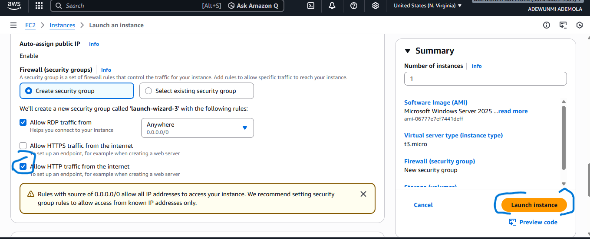

## step 8: Launch Confirmation Page

It will take you to another page with a success display. Now we are halfway to seeing how the instance works. Click on the digit you are seeing on the success display.

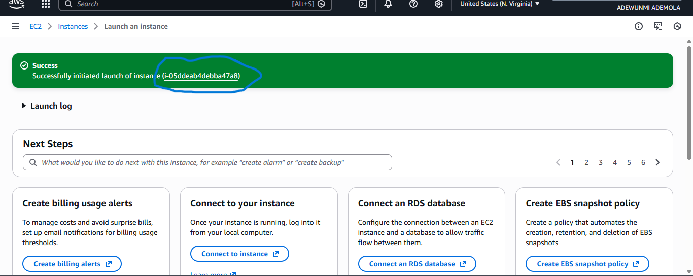

It will take you to the Connect page. On the page, click RDP Client, which will take you to the remote desktop file page.

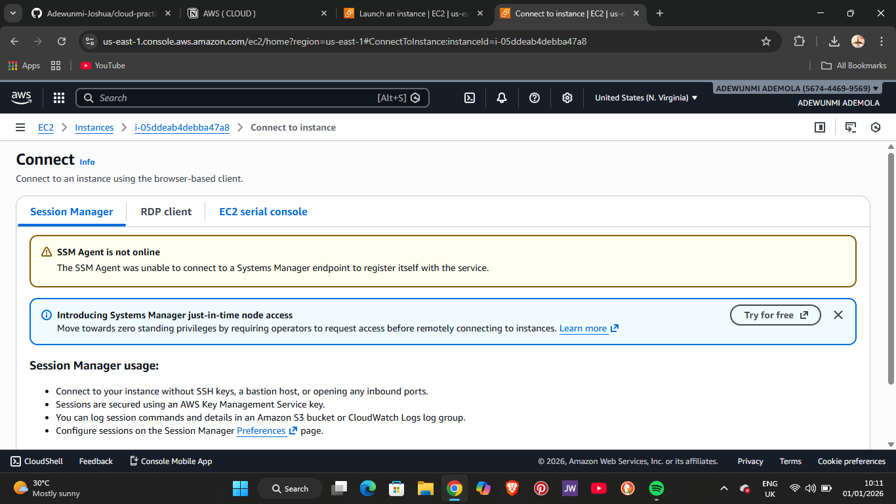

## step 9: Download the Remote Desktop File

Click on Download Remote Desktop File. It will download a remote desktop file that will be used to launch your instance.

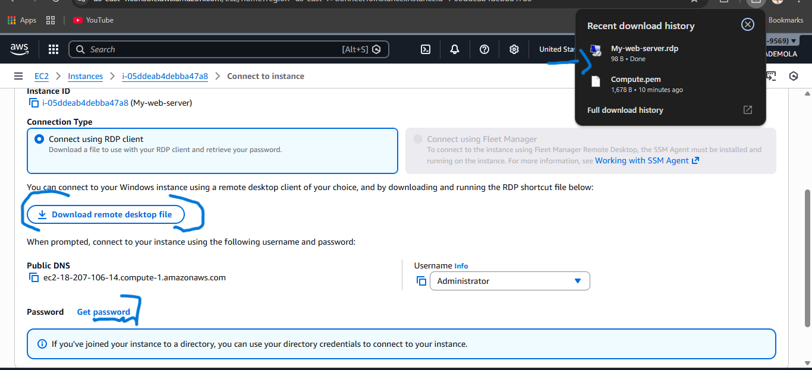

Then click on Get Password. Click on Upload private key pair and upload the key pair you downloaded earlier. Click on Decrypt password.

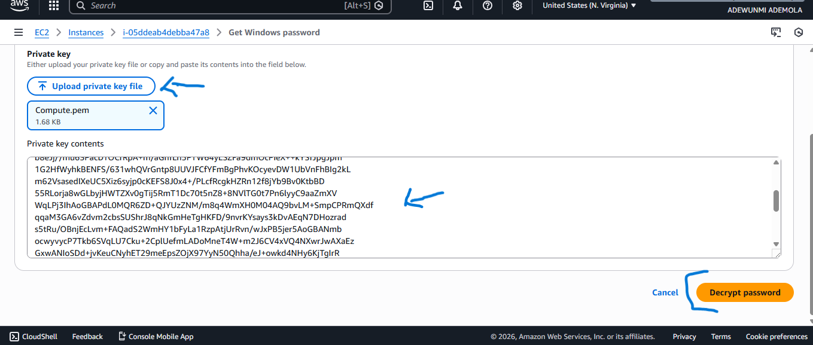

- After clicking Decrypt Password, it will take you back to the previous page. Now go to the top right, where you always view what you downloaded, and click on the Remote Desktop File.

- It will bring up some warnings, but that is fine—you can click OK. A pop-up window for login will appear. Copy the password and paste it into the password input, then click ok.

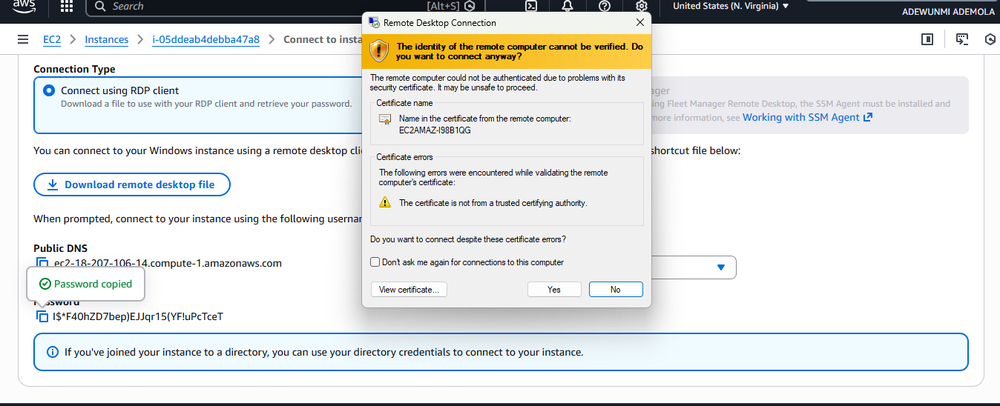

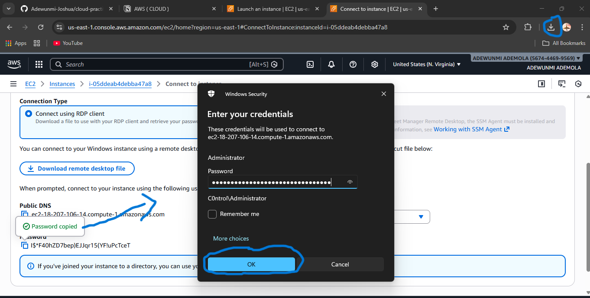

## step 10: Accessing Your EC2 Instance

Give it a few minutes, and you will see the instance (virtual compute) we just launched. This is  another computer set up on your system. All the setup processes are what make up the instance.

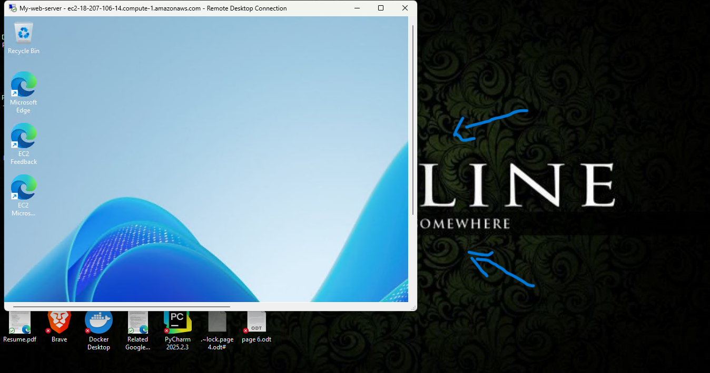

Remember I said you can stop it, terminate it, and so on.

Go back to the AWS page and click on Instances. At the top left, you will see the list of instances that are running and a lot of details about your instance. Now click on Instance State. You will see Stop as an option.

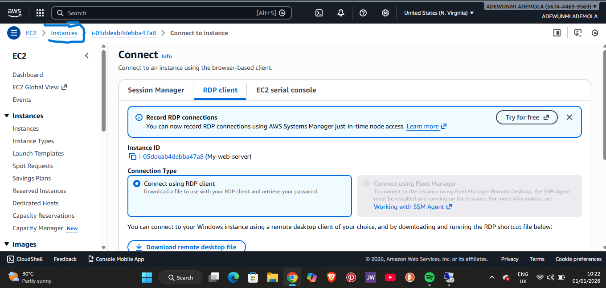
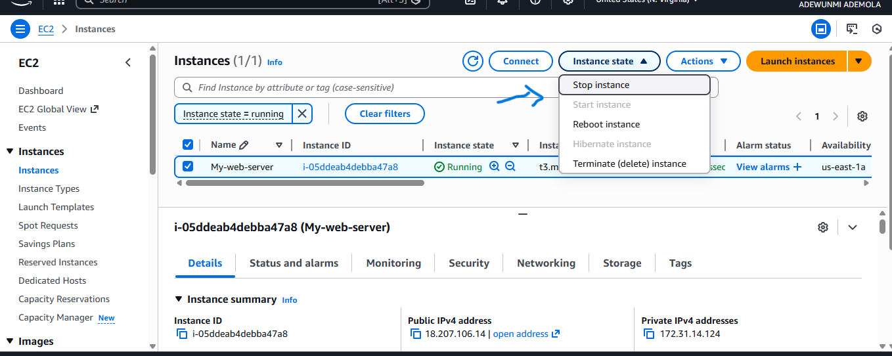

The main reason to stop it is that AWS bills you a small amount for the time it is running. Remember, you only pay for what you are using. If you are using a free account, it will be deduct from the free tier credits provided by AWS . If it is not free account, you will have to pay for it yourself.
